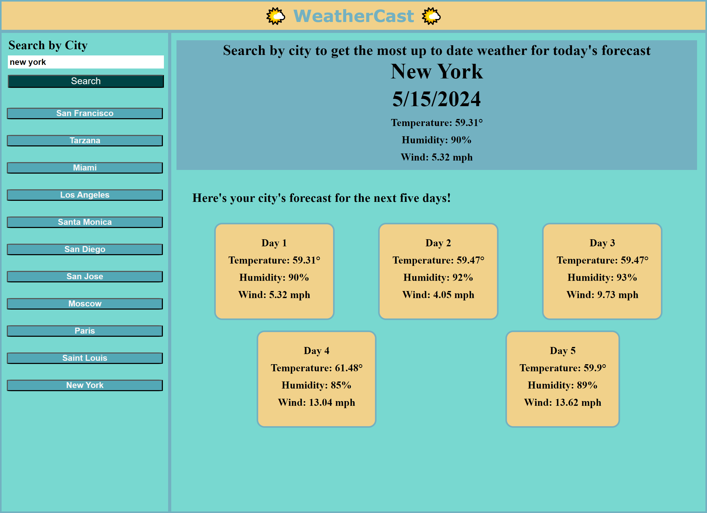

# WeatherCast

## WeatherCast delivers real-time and forecasted weather conditions for cities across the globe!

- This application allows users to check the current weather and a 5-day forecast for any city. It also maintains a search history, enabling quick access to previously searched locations.

## User Interface

- Users have the option to search for any city to view both current weather conditions and a 5-day forecast.

- When users search for a city, they receive detailed information on the current weather, including the city name, date, temperature, humidity, and wind speed.

- In addition to the current weather, users can access a 5-day forecast for the selected city, which includes the date, temperature, humidity, and wind speed for each day.

- Users can easily retrieve weather information for previously searched cities as the application maintains a search history feature.

- By clicking on a city from their search history represented by its own button, users can promptly access both current and upcoming weather conditions for that location.

## Technologies Used

- HTML/CSS for styling and structure.

- JavaScript for the interactive elements and manipulation of local storage.

- OpenWeather API for fetching weather data by city.

## Screenshot

## Usage

[Link to Deployed Website](https://acoderrose.github.io/WeatherCast/)

[Link to GitHub Repository](https://github.com/AcoderRose/WeatherCast)

## Collaborators

[Jordan Gonzales](https://github.com/JordanGWiz)

[Kaila Ronquillo](https://github.com/girlnotfound)

[Ryan Petersen](https://github.com/RyanPetersen-89)
